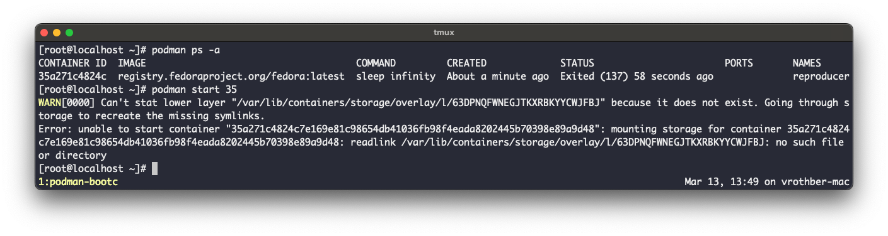

# physically-bound-image-reproducer

1. Run `podman build -t reproducer .`
2. Start a VM via `podman-bootc run reproducer`
3. Inside the VM run `reproducer.sh`.  You now have a container named "reproducer" running inside the VM using the `fedora:latest` image.  You can run `podman images` and `podman ps --all` to have a look.
4. Shutdown the VM by running `poweroff`.
5. Restart the VM via `podman-bootc run reproducer`.  The container is still there but the `fedora:latest` image isn't anymore as it has been replaced with `alpine:latest` in the additional image store.
6. Now try to start the container via `podman start reproducer`.  You will run into the error shown on the screenshot below.  The container cannot be started anymore as the `fedora:latest` image has been replaced and its layer are not available in the additional image store.  Pulling down images that would reuse layers from the additional image store are also subject to this error.

# workaround

See the `Containerfile.workaround` with the two scripts to embed images at build time and copy them into the mutable store at runtime.
NOTE: if you are referencing an image by the digest of its "parent" manifest list, make sure to use `embed_image.sh <IMAGE> --all`.  This will instruct skopeo to copy the entire manifest list and all images to preserve the parent digest.
